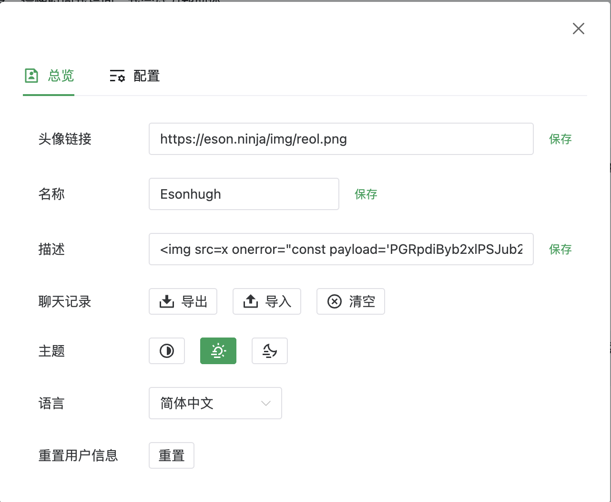
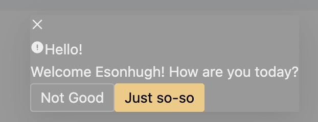

# ChatGPT-Web-Setting-Funny-Abuse

Play with ChatGPT-Web and found the HTML rendering in description settings.

### Usage

1. Download repo.
2. Editing the test.html as you want
3. If you want restore, check the raw_content.html
4. Editing the test.js if you need
5. Using command `python crafted.py`
6. Copy the generated string as setting in description
7. (Optional) Click the Errored image to fast export the json based Chat History.

### Demo

Step 6 Looks like:

And Save it.

Enjoy the chatGPT and have fun!

Also [ChatGPT-Web](https://github.com/Chanzhaoyu/chatgpt-web) is a cool project. Respect for the author.